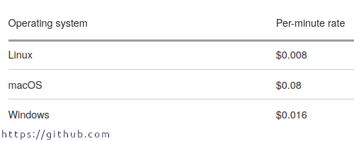

```{r setup, include=FALSE}
options(htmltools.dir.version = FALSE)
library("tidyverse")
library("png")
knitr::opts_chunk$set(
  fig.width=10, fig.height=5, fig.retina=3,
  fig.showtext = TRUE,
  out.width = "100%",
  cache = FALSE,
  echo = TRUE,
  message = FALSE, 
  warning = FALSE,
  fig.show = TRUE,
  hiline = TRUE
)
```

```{r xaringan-themer, include=FALSE, warning=FALSE}
library("xaringanthemer")
style_duo(
  link_color = "#EFBE43",
  text_color = "#000000",
  header_color = "#0072B2",
  primary_color = "#FDF7E9",
  secondary_color = "#EFBE43",
  inverse_header_color = "#FFFFFF",
  table_row_even_background_color = NULL
)
```

```{r load-mockups, eval = TRUE, echo = FALSE, warning=FALSE, message=FALSE, include = FALSE}
pests_names <- readRDS("pests_names.RDS")
hosts_names <- readRDS("hosts_names.RDS")
pests <- readRDS("pests.RDS")
hosts <- readRDS("hosts.RDS")
taxonomy <- readRDS("taxonomy.RDS")
category <- readRDS("category.RDS")
cucumis_df <- readRDS("cucumis_df.RDS")
oryza_df <- readRDS("oryza_df.RDS")
```

class: inverse right title-slide split-70

<style>
.title-slide .remark-slide-number {
  display: none;

}
.title-slide h1 {
  text-shadow: none;
  color: #0072B2;
  margin-top: -10px;
}
.title-slide h2 {
  text-shadow: none;
  color: #0072B2;
}
.title-slide h3 {
  text-shadow: none;
  color: #0072B2;
}
</style>

.row[.content.vmiddle.left[
# &#x1f973; Stop worrying and use `r icon::fa_r_project(colour = "#384CB7")` to query EPPO &#x1f41b;
]]
.row[.content.right.vmiddle[
### Michał Czyż `r Sys.Date()`
]]

<a href="https://github.com/mczyzj" class="github-corner" aria-label="View source on GitHub"><svg width="100" height="100" viewBox="0 0 250 250" style="fill:#70B7FD; color:#fff; position: absolute; top: 0; border: 0; right: 0;" aria-hidden="true"><path d="M0,0 L115,115 L130,115 L142,142 L250,250 L250,0 Z"></path><path d="M128.3,109.0 C113.8,99.7 119.0,89.6 119.0,89.6 C122.0,82.7 120.5,78.6 120.5,78.6 C119.2,72.0 123.4,76.3 123.4,76.3 C127.3,80.9 125.5,87.3 125.5,87.3 C122.9,97.6 130.6,101.9 134.4,103.2" fill="currentColor" style="transform-origin: 130px 106px;" class="octo-arm"></path><path d="M115.0,115.0 C114.9,115.1 118.7,116.5 119.8,115.4 L133.7,101.6 C136.9,99.2 139.9,98.4 142.2,98.6 C133.8,88.0 127.5,74.4 143.8,58.0 C148.5,53.4 154.0,51.2 159.7,51.0 C160.3,49.4 163.2,43.6 171.4,40.1 C171.4,40.1 176.1,42.5 178.8,56.2 C183.1,58.6 187.2,61.8 190.9,65.4 C194.5,69.0 197.7,73.2 200.1,77.6 C213.8,80.2 216.3,84.9 216.3,84.9 C212.7,93.1 206.9,96.0 205.4,96.6 C205.1,102.4 203.0,107.8 198.3,112.5 C181.9,128.9 168.3,122.5 157.7,114.1 C157.9,116.9 156.7,120.9 152.7,124.9 L141.0,136.5 C139.8,137.7 141.6,141.9 141.8,141.8 Z" fill="currentColor" class="octo-body"></path></svg></a><style>.github-corner:hover .octo-arm{animation:octocat-wave 560ms ease-in-out}@keyframes octocat-wave{0%,100%{transform:rotate(0)}20%,60%{transform:rotate(-25deg)}40%,80%{transform:rotate(10deg)}}@media (max-width:500px){.github-corner:hover .octo-arm{animation:none}.github-corner .octo-arm{animation:octocat-wave 560ms ease-in-out}}</style>

---

layout: true
class: shuriken-200 white 

.blade1.bg-red.content.center[.vmiddle[
# .white[Search]
]]
.blade2.bg-green[.content.vertical-rl.center.vmiddle[
# .white[Copy-paste]
]]
.blade3.bg-indigo[.content.center.vmiddle[
# .white[Spreadsheet]
]]
.blade4.bg-orange[.content.sideways-rl.center[
# .white[Go to the next next link&nbsp;]
]]
.hole.bg-black[.content.center.vmiddle[
{{content}}
]]

---

class: hide-blade2 hide-blade3 hide-blade4 hide-hole

---

class: hide-blade3 hide-blade4 hide-hole
count: false

---

class: hide-blade4 hide-hole
count: false

---

class: hide-hole
count: false

---

count: false 

### `r anicon::faa("recycle", animate="spin", 
  size = 10, position =c(1,0,0,0), color = "green", speed = "slow")`

---

layout: false
class: split-three white
.row.bg-white[.content.center[
.pull-left[<font size="9" color="#0072B2">Do not show this to your boss!</font>]

.right[]
]]

--
.row.bg-green[.content.vmiddle.center[
## .white[Use scripting language to do boring stuff for you.]
]]

--
.row.bg-indigo[.content.vmiddle.center[
## .white[Enjoy your] <font size="11">&#x2615; &#x1f973;</font>
]]

---
class: split-three white

.column.bg-white[.content.vmiddle[
<font size="8" color="#0072B2">As it is appealing it takes time and skills to write code.</font>
]]

--
.column.bg-green[.content.vmiddle[
<font size="8" color="white">Not the most effective thing to do, for rare or <i>one-time</i> tasks.</font>
]]

--
.column.bg-indigo[.content.vmiddle[
<font size="8" color="white">The more often code is used the more expensive it is to maintain. Thus, most effort should be put into development phase.</font>
]]

---
class: inverse center middle

# Don't worry! I will take burden from your shoulders with

.center[]

---
layout: true
class: split-10

.column.bg-main1[.content.sideways-rl.center[
# So what is `pestr`?
]]
.column.bg-indigo[.content[
  .split-three.border-white[
  .row[.content.vmiddle[
  <font size="6" color = "white"> <b>R</b> Package to make batch queries for <a href = "https://data.eppo.int">EPPO Data Services.</a></font>
  ]]
  .row[.content.vmiddle[
  <font size="6" color = "white">Only most basic skills needed.</font>
  ]]
  .row[.content.vmiddle[
  <font size="6" color = "white">Output can be easily processed with <b>R</b> or dumped into spreadsheet.</font>
  ]]
]]]

---

class: hide-row1-col2 hide-row2-col2 hide-row3-col2 with-border border-white

---

class: hide-row2-col2 hide-row3-col2 with-border border-white
count: false

---

class: hide-row3-col2 with-border border-white
count: false

---

class: with-border border-white
count: false


---
layout:false
class: inverse center

# pestr structure

***

```{r echo=FALSE, eval = T}
library("DiagrammeR")

DiagrammeR::grViz(
'digraph G {
  rankdir=LR
  graph[bgcolor = "#FDFDFD"]
  edge[style=invis]
  node[fontname = "helvetica", width = 1.5, height = 0.5, fontsize=12]

  subgraph cluster_db {
    label = "SQLite database tools";
    style=dashed;
    color= "#625a5a";
    fontname = "helvetica-bold";

    node [shape=cylinder, style=filled, color=black, fillcolor = "#91cf60"];
    a0[label = "  eppo_database_check  "]
    a1[label = "eppo_database_download"]
    a2[label = " eppo_database_connect "]
    a3[label = "    eppo_names_tables    "]
    a4[label = " eppo_tabletools_names "]

    a0 -> a2
    a1 -> a4

  }

  subgraph cluster_token {
    node [shape = signature, style = filled, color=black, fillcolor = "#fee08b"];
    label = " Authorization token tools ";
    style=dashed;
    color= "#625a5a";

    fontname = "helvetica-bold";

    s0[label = "check_eppo_token"]
    s1[label = "create_eppo_token"]
    s3[style=invis]

  }

  subgraph cluster_eppo {
    node [shape = tab, style = filled, color=black, fillcolor = "#fc8d59"];
    label = "EPPO Global Database/Data Services tools";
    style=dashed;
    fontname = "helvetica-bold";
    color="#625a5a"

    b0[label = "eppo_tabletools_host"]
    b1[label = "eppo_tabletools_pests"]
    b2[label = "eppo_tabletools_taxo"]
    b3[label = "eppo_tabletools_cat  "]

    b0 -> b1
    b2 -> b3

  }

  a2 -> s0 -> b0
}')
```

***

---
class: inverse center middle

# You need:
# 0 SQL
# 0 REST API
# 0 Web Scraping

---
layout: true
class: split-10

.column.bg-main1[.content.sideways-rl.center[
# Working with `pestr`
]]
.column.bg-indigo[.content[
  .split-33.border-white[
  .row[.content[
<font size="6" color = "white">Initial setup</font>
```{r eval = FALSE, echo = TRUE}
{{ pestr::eppo_database_download() }}
eppoDB <- pestr::eppo_database_connect(filename = "eppocodes.sqlite")
eppo_token <- pestr::create_eppo_token("your_eppo_token")
```
  ]]
  .row[.content[
<font size="6" color = "white">Basic functions</font>
```{r eval = FALSE, echo = TRUE}
pests_query <- c("Xylella", "suzuki")
hosts_query <- c("Triricum durum", "Abies al")
pests_names <- pestr::eppo_names_tables(pests_query)
hosts_names <- pestr::eppo_names_tables(hosts_query)
hosts       <- pestr::eppo_tabletools_hosts(pests_query, token = eppo_token)
pests       <- pestr::eppo_tabletools_pests(hosts_query, token = eppo_token)
category    <- pestr::eppo_tabletools_cat(pests_query, token = eppo_token)
taxonomy    <- pestr::eppo_tabletools_taxo(pests_query, token = eppo_token)
```
  ]]
]]]

---

class: hide-row1-col2 hide-row2-col2 with-border border-white

---

class: hide-row2-col2 with-border border-white
count: false

---

class: with-border border-white
count: false

---
layout: true
class: split-10 with-border border-white

.column.bg-main1[.content.sideways-rl.center[
# Output structure
]]
.column.bg-indigo[.content[
  .split-two.border-white[
  .row[.content.vmiddle[  
  .font_large[`eppo_names_tables` .white[function return 4 tables: *exists_in_DB*, *not_in_DB*, *pref_names* and *all_associated_names*.]]
   ]]
  .row[.content.vmiddle[
  .font_large[`eppo_tabletools_*` .white[functions family returns always two tables: *long_table* and *compact_table*. The structure of *long_table* is different for different outputs since we are dealing with different data. *compact_table* contains the same data as *long_table* but condensed to one row per *eppocode*.]]
  ]]]]]


---

class: hide-row1-col2 hide-row2-col2

---

class: hide-row2-col2
count: false

---

count: false

---
layout: true
class: split-10 with-border border-white

.column.bg-main1[.content.sideways-rl.center[
# Output structure
]]
.column.bg-indigo[.content[
  {{content}}
  ]]

---
```{r eval = TRUE, echo = TRUE}
pests_names$exist_in_DB
```

---
```{r eval = TRUE, echo = TRUE}
pests_names$pref_names
```

---
```{r eval = TRUE, echo = TRUE}
head(pests_names$all_associated_names, 10)
```

---
```{r eval = TRUE, echo = TRUE}
head(hosts$long_table, 10) %>%
  flextable::flextable()  %>% #<< 
  flextable::bg(bg = "white", part = "all") %>% #<<
  flextable::width(5:6, 2.5) #<<
```
---
```{r eval = TRUE, echo = TRUE}
pests$compact_table %>% 
  flextable::flextable() %>% #<<
  flextable::bg(bg = "white", part = "all") %>% #<<
  flextable::width(2, 9) #<<
```

---
```{r eval = TRUE, echo = TRUE}
head(taxonomy$long_table, 10) %>%
  flextable::flextable() %>% #<< 
  flextable::bg(bg = "white", part = "all") #<<
```

---
```{r eval = TRUE, echo = TRUE}
head(category$long_table, 10) %>%
  flextable::flextable() %>% #<< 
  flextable::bg(bg = "white", part = "all") 
```

---
layout: false
class: split-10 with-border border-white

.column.bg-main1[.content.sideways-rl.center[
# Save your results
]]
.column.bg-indigo[.content[
```{r eval = FALSE, echo = TRUE}
write.csv(pests_names$preferred_names, "pest_pref_names.csv")
write.csv(hosts$long_table, "hosts_long.csv")
```
# .white[OR]
```{r eval = FALSE, echo = TRUE}
saveRDS(pests_names, "pests.RDS")
saveRDS(hosts, "hosts.RDS")
```
]]

---
class: inverse center middle

## That is it. That is all you need to know.

---
class: inverse center middle

## Or... is it...?

---
class: inverse center middle
## What are you going to do with your data?

---
layout: true
class: shuriken-200 white 

.blade1.bg-red.content.center[.vmiddle[
# .white[Copy-paste to Spreadsheet]
]]
.blade2.bg-green[.content.vertical-rl.center.vmiddle[
# .white[Process manually]
]]
.blade3.bg-deep-purple[.content.center.vmiddle[
# .white[Make ugly charts with default settings]
]]
.blade4.bg-orange[.content.sideways-rl.center[
# .white[Waste. Your. Time.&nbsp;&nbsp;]
]]
.hole.bg-black[.content.center.vmiddle[
{{content}}
]]

---

class: hide-blade2 hide-blade3 hide-blade4 hide-hole

---

class: hide-blade3 hide-blade4 hide-hole
count: false

---

class: hide-blade4 hide-hole
count: false

---

class: hide-hole
count: false

---

count: false 

### `r anicon::faa("recycle", animate="spin", 
  size = 10, position =c(1,0,0,0), color = "green", speed = "slow")`

---

layout: false
class: inverse middle center

# What can you achievie with spending just 15 more minutes on coding?

---

layout: true
class: split-10 with-border border-white

.column.bg-main1[.content.sideways-rl.center[
# Simple functions
]]
.column.bg-indigo[.content.vmiddle[
  {{content}}
  ]]

---

```{r eval = FALSE, echo = TRUE}
taxons_heatmap <- function(query, eppo_token) {
  query_names <- pestr::eppo_names_tables(query)
  
  hosts_eppocode <- query_names$pref_names %>%
    dplyr::filter(grepl(paste0("^", query), fullname)) %>%
    .$eppocode
  
  query_pests <- pestr::eppo_tabletools_pests(token = eppo_token, 
                  raw_eppocodes = hosts_eppocode, use_raw_codes = TRUE)
  
  unique_pests <- query_pests$long_table %>%
    dplyr::filter(!is.na(pests_eppocode)) %>%
    .$pests_eppocode %>%
    unique
  
  pest_taxonomy <- pestr::eppo_tabletools_taxo(token = eppo_token,
                     raw_eppocodes = unique_pests,
                     use_raw_codes = TRUE)
  
  taxon_plot_df <- pest_taxonomy$compact_table %>%
    dplyr::rename(pests_eppocode = eppocode) %>%
    dplyr::left_join(query_pests$long_table) %>%
    dplyr::group_by(eppocode) %>%
    dplyr::count(taxonomy) %>%
    group_by(n_taxons = cut(n, breaks = c(seq(1,51,2), Inf), right = FALSE))
  
  return(taxon_plot_df)
}
```

---

<font size="5" color = "white">It took ca. 14 seconds to execute.</font>
```{r eval = FALSE, echo = TRUE}
oryza_for_plot <- taxons_heatmap("Oryza", eppo_token)

oryza_for_plot %>%
  ggplot(aes(x = eppocode, y = taxonomy, fill = n_taxons)) +
  theme_bw() +
  geom_tile() +
  scale_fill_viridis_d(direction = -1) +
  theme(axis.text.x = element_text(angle = 90)) +
  xlab("Host eppocode")
```

<font size="5" color = "white">It took ca. 11 secs seconds to execute</font>
```{r echo = TRUE, eval = FALSE}
cucumis_for_plot <- taxons_heatmap("Cucumis", eppo_token)

cucumis_for_plot %>%
  ggplot(aes(x = eppocode, y = taxonomy, fill = n_taxons)) +
  theme_bw() +
  geom_tile() +
  scale_fill_viridis_d(direction = -1, option = "C") + #<<
  theme(axis.text.x = element_text(angle = 90), panel.grid = element_blank()) + #<<
  xlab("Host eppocode")+
  labs(title = "Genus: Cucumis", subtitle = "Number of pest taxons", fill = "No. taxons") + #<<
  guides(fill = guide_legend(reverse = TRUE)) #<<
```

---

```{r echo = FALSE, eval = TRUE}
oryza_df %>%
  ggplot(aes(x = eppocode, y = taxonomy, fill = n_taxons)) +
  theme_bw() +
  geom_tile() +
  scale_fill_viridis_d(direction = -1) +
  theme(axis.text.x = element_text(angle = 90)) +
  xlab("Host eppocode")
```

---

```{r echo = FALSE, eval = TRUE}
cucumis_df %>%
  ggplot(aes(x = eppocode, y = taxonomy, fill = n_taxons)) +
  theme_bw() +
  geom_tile() +
  scale_fill_viridis_d(direction = -1, option = "C") +
  theme(axis.text.x = element_text(angle = 90), panel.grid = element_blank()) +
  xlab("Host eppocode") +
  labs(title = "Genus: Cucumis", subtitle = "Number of pest taxons", fill = "No. taxons") +
  guides(fill = guide_legend(reverse = TRUE))
```

---
layout: true
class: split-10 with-border border-white

.column.bg-main1[.content.sideways-rl.center[
# Take home messages.
]]

.column.bg-indigo[.content[
  .split-three.border-white[
  .row[.content.vmiddle[
  <font size="6" color = "white">Use available solutions to automate your work.</font>
  ]]
  .row[.content.vmiddle[
  <font size="6" color = "white">Learn basic coding techniques and speed up things.</font>
  ]]
  .row[.content.vmiddle[
  <font size="6" color = "white">Stop wasting time on repetitive and boring tasks.</font>
  ]]
]]]

---

class: hide-row1-col2 hide-row2-col2 hide-row3-col2 with-border border-white

---

class: hide-row2-col2 hide-row3-col2 with-border border-white
count: false

---

class: hide-row3-col2 with-border border-white
count: false

---

class: with-border border-white
count: false

---

layout: false
class: center, middle

# Thank you for listening!

Slides created via the R packages:

<a href="https://github.com/yihui/xaringan"></a><a href="https://github.com/gadenbuie/xaringanthemer"></a><a href="https://davidgohel.github.io/flextable/"></a></a><a href="https://rmarkdown.rstudio.com"></a>

***

with some help of:<br>

***

<a href="https://github.com/mczyzj/pestr"></a><a href="https://github.com/tidyverse/ggplot2"></a><a href="https://github.com/tidyverse/dplyr"></a><a href="https://github.com/yihui/knitr">
